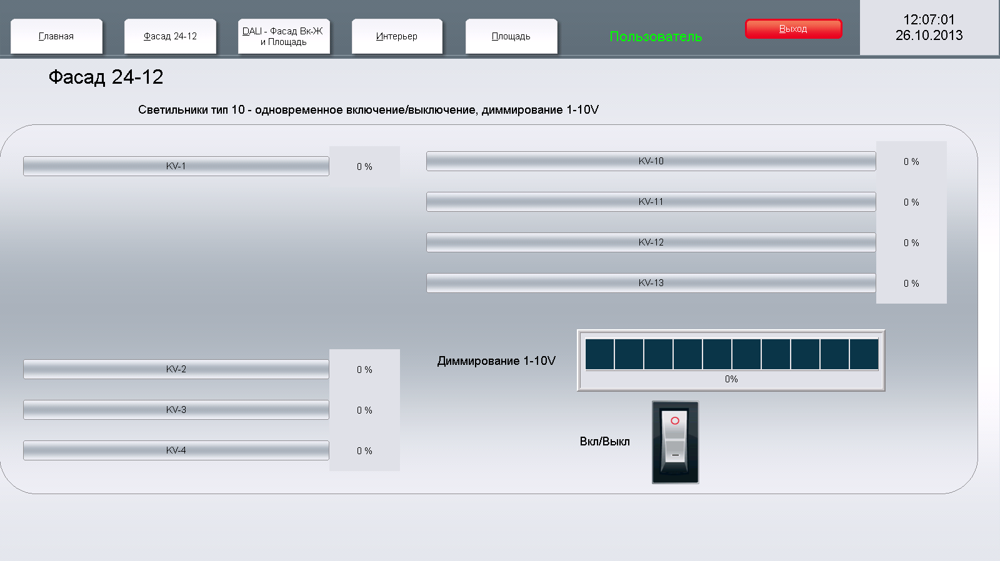

## Summary
The **Moscow City Smart City Project** involves integrating smart systems across five different office building groups, each with unique requirements for smart systems and linking. The primary responsibilities include the computer programming of the central control system and night light adjustment, managing over 800 square meters with 15,000 signals from various controllers.

## Key Features
- **Central Control Programming**: Development of a centralized control system to manage building operations efficiently.
- **Night Light Adjustment**: Implementing smart lighting solutions for optimal energy use and ambiance.
- **Signal Management**: Handling 15,000 signals from various controllers across 800 square meters.

## Technologies Used
- **Smart Building Systems**
- **Centralized Control Programming**
- **Lighting Automation**

## Software Interface
From the centralized control panel, the entire building's lighting can be managed. This includes controlling lights, dimming them, and playing different lighting scenarios for various needs and events.

*The centralized panel interface allows for full control over the building's lighting, including turning lights on and off, dimming, and setting up different lighting scenarios.*

*Another view of the software interface showing detailed control options and real-time monitoring capabilities for the building's smart lighting system.*

## Tags
- Smart City
- Building Automation
- Lighting Control

## Links
- [Moscow City Smart City Project](http://domussapiens.ru/nashi-obekty/kommercheskie-obekty/moskva-siti) <!-- External link to the project details -->
